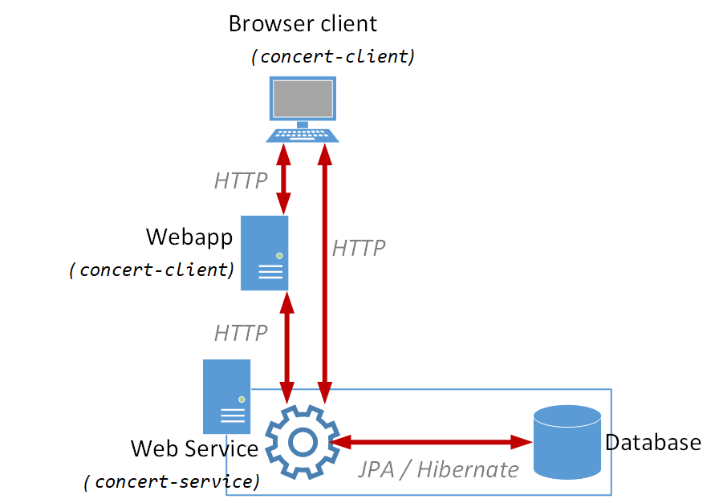
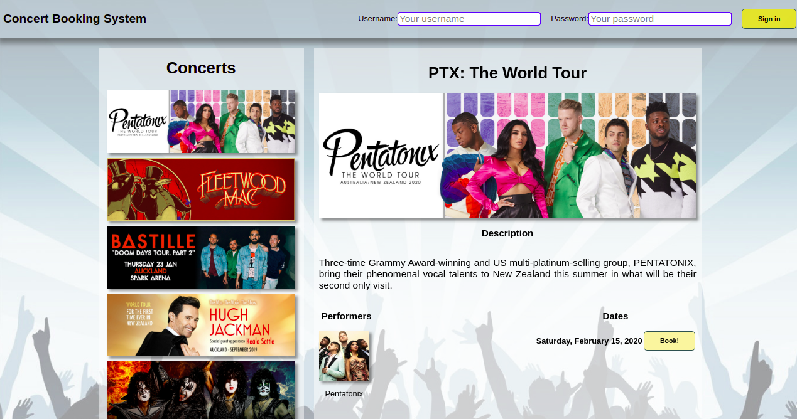
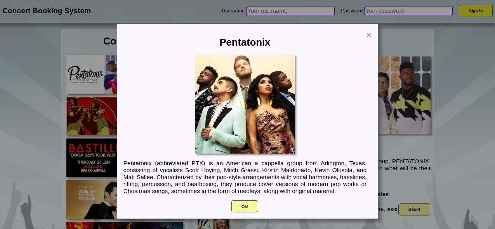
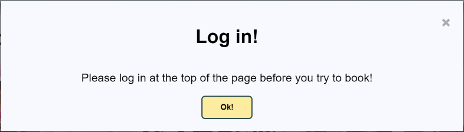
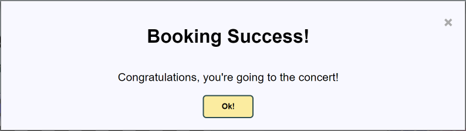

Project - A Concert Booking Service
==========

The aim of this project is to build a Web service for concert booking. This project was completed for CS 331 in S1 2021, with work roughly divided in a team of 3.

System description
----------
A booking service is required for a small venue, with a capacity of 120 seats. The venue's seats are classified into three price bands, Silver, Gold and Platinum. A concert may run on multiple dates, and each concert has at least one performer. Additionally, a performer may feature in multiple concerts.

The service is to allow clients to retrieve information about concerts and performers, to make and enquire about seats and reservations, and to authenticate users.

When making a reservation, clients may enquire about available seats. They should be informed of any unbooked seats, along with their pricing. Clients may select any number of seats to book. When making a reservation request, double-bookings are not permitted. Only one client should be allowed to book a given seat for a given concert on a given date. Clients may not make partial bookings - either *all* of a client's selected seats are booked, or *none* of them are.

Clients may view concert and performer information, and enquire about available seating, whether or not they are authenticated. When authenticated, clients gain the ability to make reservations, and to view their own reservations. Clients should never be able to view the reservation information for other guests.

In addition, clients should be able to subscribe to information regarding concert bookings. Specifically, they should be able to subscribe to "watch" one or more concerts / dates, and be notified when those concerts / dates are about to sell out.

A particular quality attribute that the service must satisfy is scalability. It is expected that the service will experience high load when concert tickets go on sale. 

Resources
----------
A multi-module Maven project, `asg-concert`, is supplied and comprises 3 modules: 

- `concert-client`. A module that contains resources for building a concert client application.

- `concert-common`. This module defines several entities that are shared by the `client` and `service` modules.

- `concert-service`. The `service` module is responsible for implementing the Web service and persistence aspects of the concert application.

The parent project's POM includes common dependencies and properties that are inherited by the 3 modules.

#### System architecture
The system as a whole is a *tiered* architecture, in which a browser application, driven by a *web app*, communicates via HTTP with the *web service* you will create for this project. A high-level overview can be seen in the below diagram:

#### Client module
The client module contains a *web application*, built using technologies such as HTML5, CSS, JavaScript, JSP, and JSTL. This web application is capable of acting as a *client* to the web service which you will create for this project, as shown in the diagram above. The client contains both browser-based and server-based code (written in JavaScript and Java, respectively) which communicate with the `service` layer over HTTP.

#### Common module
This module includes a number of packages:

- `asg.concert.common.dto`. This package contains complete implementations for 7 DTO classes. The `client` webapp above, and the integration tests (see below), are defined in terms of the DTO classes.
	
- `asg.concert.common.jackson`. This package includes the Jackson serializer and deserializer implementations for Java's `LocalDateTime` class.

- `asg.concert.common.types`. This package defines basic data types that are common to the `client` and `service` modules. The types comprise 2 enumerations: `Genre` (for performers), and `BookingStatus` (for querying available / unavailable seats).

#### Service module
The `service` module will contain your completed Web service for the project. It contains the following packages:

- `asg.concert.service.domain`. This package contains the web service's completed domain model.

- `asg.concert.service.jaxrs`. This package contains the `LocalDateTimeParam` class. This class allows us to receive `LocalDateTime` instances as *query* or *path* parameters.

- `asg.concert.service.mapper`. This package contains mapper classes, which map between domain and DTO classes.

- `asg.concert.service.services`. This package contains the `ConcertResource` class. It also contains a `PersistenceManager` class which can be used to obtain `EntityManager` instances when required, a complete `ConcertApplication` class, and a `TestResource` class which implements a web service endpoint to reset the database. This is used for testing purposes.

- `asg.concert.service.util`. This package contains the `ConcertUtils` class, which can re-initialize the database, and the `TheatreLayout` class, which can be used to generate `Seat`s for a particular concert date.

Beyond packages and source files, the `service` module contains the JPA `persistence.xml` file, a database initialise script (`db-init.sql`) and a `log4j.properties` file (in `src/main/resources`). Finally, integration tests are included in the `src/test/java` folder. As usual, these tests may be run by executing Maven's `verify` goal on the parent project, and a 100% pass-rate (along with correct client functionality) is a good indication that your service implementation is correct.

The `persistence.xml` file includes a `javax.persistence.sql-load-script-source` element whose value is the supplied`db-init.sql` script. The effect of this element is to run the script when the `EntityManagerFactory` is created.`db-init.sql` file populates the database with concert and performer data.

Appendix: The client webapp.
----------
The `concert-client` project contains a complete web application which is designed to communicate with your web service from both its server-side (Java) and client-side (JavaScript) code, to deliver its functionality.

#### App usage
Using the application, browsing to `/Concerts` or simply `/` (within the webapp's *context*) will present the "homepage" of the app, allowing the user to view concerts. On this page, users may scroll through the list of concerts on the left side of the page. Clicking on a concert will cause that concert's info to be displayed in the detail view.

On the detail view, users can see more information about the currently selected concert, as well as a list of performers and dates for that concert.

Clicking on a performer's image will display a modal dialog containing more information about that performer:

If the user hasn't logged in, then clicking on the "Book!" button next to one of a concert's dates will prompt the user to sign in:

If the user has already signed in, they will be redirected to the seat selection page for their selected concert and date. See `concert-service/src/main/resources/db-init.sql` for the data that the server is initialised with, including possible users and their passwords.

Here, users can see a visual seat map of the venue, along with an indicator of which seats have already been booked. Clicking unbooked seats will toggle a blue halo around that seat - an indicator that the seat has been selected for booking, as can be seen in the above screenshot. A list of selected seats - along with the total ticket price - can be seen below the seat map.

Once the user has made their selection, they can click the "Book!" button. Assuming they have "sufficient funds" (which will always be true for this test case), and that no other user has booked the same seats in the meantime, the user will be presented with a success dialog box:

Dismissing the dialog will redirect the user back to the concerts page, where they may continue to book tickets at other concerts / dates. (or more tickets for the same concert / date).

#### Limitations
The webapp currently *partially* exercises the web service you are required to create for this project. Functionality for a user to view their bookings is not implemented, though this is required by the web service specification. Additionally, the webapp does not participate in the *publish / subscribe* functionality required of the service.